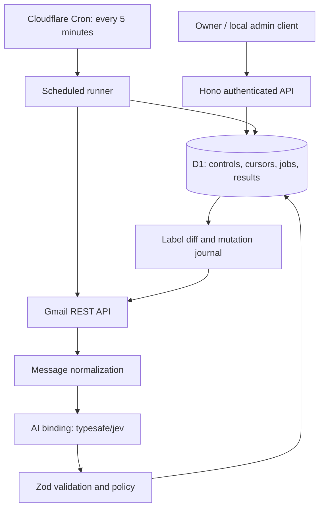

# Architecture

## 1. Components



One Worker exports `fetch: app.fetch` and a `scheduled` handler. Cron owns processing; HTTP mutations enqueue durable jobs and return promptly. API status/history requests query D1. There is no in-memory background queue and no reliance on module-global state for locks or durable progress.

D1 is enough for a low-volume single mailbox. Cloudflare Queues can replace the job-dispatch mechanism later if backlog or latency requires it, while preserving the same job and idempotency contracts.

### AI access and content handling

Provisionally call Jev with the existing `AI` binding and a third-argument gateway configuration using `AI_GATEWAY_ID`. AI Gateway is a provisioned resource/configuration, not a replacement binding. Plan for Unified Billing; Phase 0 compares plain and explicit-gateway calls because Cloudflare's model example and general binding requirements differ. Record whether pricing is per token, per request, or another unit from the actual account's billing documentation.

Set `skipCache: true` and `collectLog: false` for email inference and verify effective gateway logging/caching settings. Application non-retention of bodies does not establish Cloudflare/provider retention guarantees. Log only operational identifiers and usage, not gateway payloads.

## 2. Gmail client and credentials

Use `https://gmail.googleapis.com/gmail/v1/users/me/...` through a narrow fetch client. Required methods: profile, labels list/create/patch, messages list/get/modify, and history list.

Request `https://www.googleapis.com/auth/gmail.modify`: the app must read message bodies and modify their labels. `gmail.labels` alone manages label definitions and is insufficient for this workflow. Gmail's OAuth grant is broader than the operations exposed by this application.

A local TypeScript OAuth bootstrap helper runs with Bun and obtains offline access using a registered localhost redirect, random browser-bound state, and Google's maintained Node OAuth library. Verify that library's compatibility with the pinned Bun version during setup. The helper runs only on the developer machine. Deploy the refresh token and client credentials as Worker secrets. The deployed Worker refreshes access tokens with Google's HTTPS token endpoint and retains access tokens only for the current execution.

Check `users.getProfile` against `GMAIL_ACCOUNT_EMAIL` before processing. Reject mismatched identity. On `invalid_grant`, persist `auth_required`, stop mailbox work, and expose the condition in status. Reconnection replaces the refresh-token secret and resets this operational error without discarding message history.

## 3. Discovery and cursor correctness

Store Gmail `historyId` values as opaque decimal **strings**, never JavaScript numbers. Gmail IDs can exceed safe integer precision and are not contiguous.

### Initial bootstrap

1. Acquire the mailbox run lease.
2. Read the mailbox profile's current history ID as anchor H0 and persist it as the scan anchor.
3. Scan `messages.list` for inbox messages received within the initial 7-day window, following all page tokens in bounded ticks. Persist an absolute cutoff and construct `in:inbox after:<epoch-seconds>` from it rather than moving a `newer_than` boundary on each page. Verify exact bounds against `internalDate`.
4. Insert discovered IDs and jobs idempotently; checkpoint the next page token after durable inserts.
5. After the scan finishes, traverse history starting at H0 to capture arrivals during the scan.
6. Advance the committed history cursor only after the history traversal's jobs are durable.

This is a bounded bootstrap, not a promise to classify the entire historical mailbox. An explicit backfill can scan an owner-selected date range later.

### Incremental sync

1. Call `history.list` from the last committed cursor. Read `messagesAdded` and `labelsAdded` event details, not the generic `messages` array that can duplicate entries.
2. Discover newly added messages and existing messages newly receiving `INBOX`. The latter covers a message moved into the inbox after initial receipt.
3. Insert an initial job only if the message has no existing discovery record. If a known message was previously skipped solely because it lacked INBOX and now receives INBOX, reactivate that initial job; completed classifications remain deduplicated. App-generated label events do not trigger inference.
4. Persist jobs before checkpointing each page. Record the run's start cursor and pagination state.
5. At the final page, commit the response history ID after all discovered work is stored. A cursor may advance while inference jobs are pending because those jobs are already durable.
6. On failure, resume the stored page. If a page token is invalid, replay from the unchanged committed start cursor; deduplication absorbs repeats.

Do not substitute a fresh profile history ID at the end: it could skip changes that were never traversed. Do not filter history so narrowly that `INBOX` additions are missed.

### Expired cursor

An HTTP 404 from history synchronization triggers resynchronization:

- Capture a new anchor before scanning.
- Rescan the **current inbox**, across all pages, to find unknown messages. Unlike the initial bootstrap, do not apply the 7-day limit: an outage may last longer.
- Reuse durable message records to avoid reclassifying completed work.
- Catch up history from the new anchor after the scan.
- Mark recovery in status; consume the scan incrementally within runtime limits.

This recovers current inbox coverage. A message that arrived and was archived during an interval whose history expired is outside this recovery guarantee. An explicit broader backfill is required for that case.

## 4. Eligibility and normalization

Fetch `messages.get?format=full`. Gmail already supplies a parsed MIME tree, so begin with a recursive Gmail payload decoder rather than adding a raw MIME parser.

Eligibility at processing time:

- Message exists and has `INBOX`.
- Exclude `SPAM`, `TRASH`, `DRAFT`, and `SENT` in the automatic pipeline.
- Recheck eligibility before applying labels; a message archived while waiting is skipped.
- An explicit correction can update an existing non-draft, non-spam, non-trash message even if it has left the inbox, because the owner selected that message.

Normalization requirements:

- Decode Gmail's base64url body data and declared charset; report unsupported decoding rather than corrupt text silently.
- Walk multipart structures. Prefer plain text over the equivalent HTML alternative, avoiding duplicate content.
- For HTML-only mail, extract readable text with a Workers-compatible parser, excluding scripts/styles and preserving meaningful boundaries. Verify the chosen library in the runtime spike.
- If a selected text body part uses an `attachmentId`, fetch that text part through the attachments API with size limits. This is body retrieval, not general file extraction.
- Include attachment names and MIME types, but not binary/PDF contents in v1.
- Conservatively trim quoted replies and signatures; record truncation and parser warnings. Preserve enough content to avoid deleting the actual request.
- Bound encoded payload, decoded text and final model input sizes; choose exact byte limits during the parsing spike and test them.
- If no usable body exists, allow subject-only classification with a `body_missing` marker; keep uncertain outcomes visible.

## 5. Durable processing state

Each scheduled run first checks the persistent mode and acquires an atomic D1 lease with a unique owner token and expiry. Only one mailbox runner proceeds. Renew between bounded units of work; stop starting work after the 120-second tick budget. A stale runner must not commit after losing its lease.

### Time and work admission

`MAX_JOBS_PER_TICK=20` is an initial upper bound. Before claiming each job and starting a network/parse/mutation stage, check remaining wall time against that stage's measured conservative allowance plus `CHECKPOINT_RESERVE_MS` (initially 15,000). Start with allowances established in the integration spike; persist completed stages and defer remaining work when the allowance does not fit. Apply this admission check to scans and cleanup as well. Never begin an external write without time for its journal handling.

`TICK_WALL_BUDGET_MS=120000` measures elapsed time, not CPU. Workers Paid cron intervals below one hour have a 30-second CPU limit; network waits do not consume that allowance, while parsing/validation does. Free cron has only 10 ms CPU and is not the production baseline. Measure CPU and wall duration separately using runtime telemetry and tune payload limits/batch size; do not infer CPU usage from an elapsed-time clock. Cron's platform wall-time limit is 15 minutes, but the application uses its smaller budget.

Reserve work time for both discovery and processing so a large scan cannot starve existing jobs. Prefer label setup and owner correction operations, then current-message work, then historical backfill. Automated label application requires a ready label mapping; if migration is pending, retain classifications and defer their application. Select only mode-eligible jobs so saved corrections waiting for apply mode do not block dry-run work.

Job stages:

```text
pending -> classifying -> classified -> applying -> completed
                  |            |            |
                  +------------+------------+-> retry_wait -> previous durable stage
                                              -> failed
pending/classified -> skipped
classified -> completed (dry-run, result retained)
```

Persist validated classification **before** Gmail mutation. In dry-run, persist the same label proposal and mark its application status `not_applied_dry_run`. Switching to apply does not silently replay every dry-run result: enqueue selected saved results explicitly, or process new messages normally.

### Daily inference budget

Before each AI attempt, atomically reserve one call against `(account_id, UTC date)` in D1, conditional on usage being below `MAX_AI_CALLS_PER_DAY` (initially 500). Every production inference path, including retries, dry-run and explicit reprocessing, uses the same guard. Count reservations conservatively even if the call fails or the process dies before dispatch; do not refund an uncertain attempt. Do not dispatch if reservation fails or D1 is unavailable.

At the limit, retain the job's last durable stage, move it to `retry_wait`, set `deferred_reason=ai_budget` and its due time to the next UTC day; budget deferral does not consume the error retry budget. Discovery and saved-result/correction application can continue. A new UTC-date row resets the allowance without deleting previous counters. Status exposes used/limit/reset time. Local evaluation uses a separate explicit call cap and reports its own usage; it must not be represented as covered by the production counter.

This is a call-volume guard, not a dollar cap. Bound input sizes and reconcile token/call usage with the verified billing units.

### Idempotency and leases

- Message identity: `(account_id, gmail_message_id)`.
- Initial job identity: one initial job per message.
- Explicit reprocess/correction: a new generation with a unique operation ID and idempotency key.
- Job claim: conditional SQL update of pending/due or expired-lease work, using `RETURNING` or verified affected-row counts.
- Use Drizzle's D1-supported batch API for related database updates, or native D1 batches for narrowly isolated SQL operations. Do not assume interactive `db.transaction()` support on D1 or hold a transaction across network calls.
- Gmail and D1 have no shared transaction. The mutation journal closes the common crash window; exactly-once inference is not guaranteed if the process dies after inference but before storing its response.
- API requests that could conflict with processing enqueue jobs; they do not mutate Gmail in parallel with the runner.

### Label mutation recovery

1. Read current labels and verify the latest correction revision, active lease ownership and app mode.
2. Derive additions/removals under ownership policy.
3. Persist a mutation intent with job generation, before-label IDs, desired-label IDs and exact diff.
4. Call `messages.modify` with `addLabelIds` and `removeLabelIds`.
5. Verify returned/current labels and mark applied in D1.
6. After a crash, re-read Gmail and reconcile the stored intent before creating a new diff. Repeating the same set additions/removals is idempotent. If a newer correction supersedes the intent, retire the old intent and reconcile the newest desired state instead of replaying stale changes.

If manual label changes are detected, stop managing affected dimensions. Since Gmail provides no conditional label-write version check, a simultaneous user edit can still race with the mutation; use a narrow diff and record it for correction.

Resolve canonical IDs and legacy aliases into semantic equivalence sets before computing the diff. An existing alias satisfies the desired label without adding its canonical counterpart. Validate the resulting IDs against approved USER-label mappings at the adapter boundary; system-label mutations are forbidden, including for corrections.

### Retry policy

Persist attempts, next attempt time, error class and last durable stage. Initial schedule: 1, 5, 15, 60 and 180 minutes with jitter, respecting a longer `Retry-After` when supplied. A retry runs on the first scheduled tick at or after its due time; the five-minute poll interval is the practical lower bound on ordinary retries. After the retry budget, mark failed and expose a retry endpoint.

| Failure | Handling |
| --- | --- |
| Gmail 401 | Refresh access token once; repeated failure becomes auth_required |
| Gmail 403 | Inspect reason: quota/rate errors back off; missing permission blocks processing |
| Gmail 404 for message | Mark message unavailable/skipped |
| Gmail 404 for history | Resynchronize inbox |
| Gmail missing label / invalid label ID | Refresh label inventory, reconcile, retry once |
| Gmail/AI 429, 5xx, transient network failure | Persistent bounded retry |
| AI invalid response | Retry once; then failed classification with diagnostic code |
| Unsupported/malformed message | Visible skipped/failed reason; no guessed result |
| D1 unavailable | Do not advance cursor or begin an unjournaled Gmail mutation |

Use request timeouts where supported. A Promise timeout alone does not cancel an AI binding call; track any unresolved call within execution lifetime and verify SDK cancellation capabilities during the integration spike. Stop the run after an uncertain timeout rather than spawning overlapping calls.

## 6. Data model

Use **Drizzle ORM** through `drizzle-orm/d1` for runtime queries. Define the database schema in `src/db/schema.ts` using `drizzle-orm/sqlite-core`; infer database row/insert types from that schema. Keep Zod for external inputs, provider responses and persisted JSON validation.

Initialize the Drizzle client from the invocation's `env.DB` binding in `src/db/client.ts` and pass it into repositories. Use parameterized Drizzle queries by default. Keep explicit parameterized SQL localized to repositories for conditional lease acquisition, job claims, or other operations that benefit from precise SQL control. Atomicity must come from database statements/batches, not a read followed by an unconditional write.

### Schema and migration workflow

1. Edit the TypeScript schema, including constraints and indexes.
2. Use **Drizzle Kit** to generate versioned SQL migrations and schema metadata into `migrations/`.
3. Review generated SQL, especially rename detection, table rebuilds and data-preserving changes.
4. Apply migrations with **Wrangler** to local D1, test them, then apply the same files to the intended remote environment.
5. Commit schema, generated migrations and Drizzle metadata together. Configure Wrangler's `migrations_dir` and Drizzle Kit's output path consistently.

Wrangler owns applied-migration tracking. Do not mix its migration history with a runtime Drizzle migrator or use schema push for production changes. Custom data migrations must be versioned alongside generated migrations. Verify generated-file layout compatibility with the selected Drizzle Kit version during setup.

`drizzle-orm` is a runtime dependency; `drizzle-kit` is development tooling. Pin compatible versions during implementation. Drizzle preserves D1's constraints: related writes use supported transactional batches, and Gmail/D1 writes still cannot share a transaction. Exact schema definitions and generated SQL are implementation deliverables.

| Table | Important columns / constraints |
| --- | --- |
| `mailboxes` | `id`, unique email, committed history ID, scan anchor/query/page, sync phase, auth status, last sync time |
| `app_control` | Singleton mode (`paused`, `dry_run`, `apply`), settings version, updated time |
| `leases` | Unique resource key, owner token, expiry; atomic acquisition and renewal |
| `operations` | ID, account ID, kind, validated request JSON, status, progress/checkpoint, creation/completion time; parent of one or more jobs |
| `idempotency_keys` | Account + route + key unique, request hash, operation ID, response metadata, expiry |
| `ai_daily_usage` | Account + UTC date unique, reserved call count, updated time; conditional atomic increments |
| `label_mappings` | Account + stable key unique, Gmail ID, current name, legacy alias IDs, migration state |
| `label_migration_operations` | Operation ID, label ID, old/new names, status, timestamps |
| `messages` | Account + Gmail ID unique, thread ID, received time, first-seen time, generation, latest result ID, dimension locks, app-owned label IDs, last observed label IDs |
| `jobs` | ID, operation ID when owner-requested, account/message ID, kind, generation, stage, attempts, next-attempt time, deferred reason, lease token/expiry, error code; partial unique initial-job index |
| `classifications` | ID, message ID, model version, taxonomy/rubric/policy versions, normalized input hash, answer JSON, decision JSON, review flag, usage, duration, application status |
| `label_mutations` | ID, job ID/generation, before/desired/add/remove IDs, status, timestamps |
| `corrections` | ID, message ID, revision, changed dimensions, replacement values, optional note, timestamp |
| `sync_runs` | ID, start/end, discovered/processed/error counts, cursor endpoints, redacted failure summary |

Index due jobs by `(stage, next_attempt_at)`, results by creation time and review state, and messages by account/Gmail ID. Use integer epoch milliseconds for application timestamps and strings for Gmail history IDs. Validate JSON columns when reading them.

The initial-job constraint must not block later generations. Define a Drizzle partial unique index equivalent to:

```sql
CREATE UNIQUE INDEX jobs_initial_message_unique
ON jobs (account_id, message_id)
WHERE kind = 'initial';
```

Also enforce uniqueness of `(account_id, message_id, kind, generation)` for message jobs. Allocate a new generation atomically for each new message operation; retries reuse the same job/generation. Idempotency-key replay returns the original operation rather than allocating another generation. Retain initial-job identity when pruning details, or rely on the retained message marker to prevent recreating initial work. Mailbox-wide operations use their own operation IDs and do not invent a message ID.

For request coalescing, enforce a partial unique operation index on `(account_id, kind)` where `status = 'queued' AND kind IN ('sync', 'label_inventory')`. Insertion conflicts return the queued operation ID. A running operation no longer occupies that queued slot, allowing at most one follow-up. Explicit idempotency keys can map to that same queued operation; preserve payload-hash conflict checks.

Retain minimal message deduplication/ownership/lock records for the connected account. Purge completed detailed results, mutation history and run diagnostics after 90 days in batches of at most `CLEANUP_BATCH_SIZE` (initially 100); retain pending intents, active jobs, and correction values needed to enforce locks. Do not persist bodies, attachments, subjects or senders. Message lists read only stored metadata. Detail requests with `includeGmailMetadata=true` may fetch Subject/From headers from Gmail in memory and return availability separately; see API.md. A failed Gmail enrichment must not hide a stored classification.

## 7. Module layout

```text
src/
  index.ts                  # fetch and scheduled exports
  app.ts                    # Hono routes and error boundary
  config.ts                 # Zod-validated environment settings
  auth/admin.ts             # Bearer auth
  gmail/client.ts           # REST client and typed error mapping
  gmail/oauth.ts            # Refresh-token exchange
  gmail/sync.ts             # Bootstrap/history/recovery
  gmail/normalize.ts        # MIME tree and body normalization
  gmail/labels.ts           # Inventory, migration, mutation adapter
  classification/jev.ts     # AI binding adapter
  classification/schemas.ts # Provider and domain schemas
  classification/rubric.ts  # Versioned questions and criteria
  classification/policy.ts  # Threshold decisions
  labels/taxonomy.ts        # Canonical keys/names/legacy mapping
  labels/diff.ts            # Pure ownership-aware label diff
  jobs/runner.ts            # Leases, bounded work, retry state
  jobs/processor.ts         # Classify/apply/correct workflow
  db/client.ts              # Drizzle D1 client factory
  db/schema.ts              # Drizzle SQLite schema and inferred types
  db/repositories/          # Typed Drizzle queries; isolated atomic SQL
  routes/                  # Status, labels, messages, operations
  observability.ts         # Redacted structured events
migrations/                 # Generated SQL and Drizzle schema metadata
drizzle.config.ts           # SQLite dialect, schema and migration output
scripts/                    # Bun-run local TypeScript OAuth/evaluation helpers
tests/                      # Unit, Worker integration, fixtures
```

Keep AI-specific response shapes inside the adapter. Gmail mutations consume validated domain decisions, never raw model output.
